<h1>Angular Store App </h1>

<h5>home</h5>
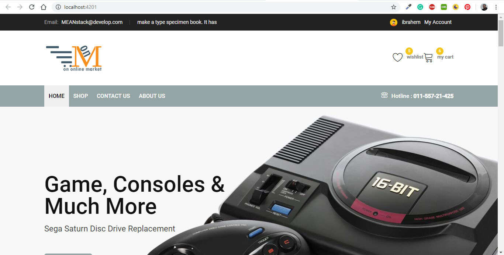 

<h5>products add to cart button and fave </h5>
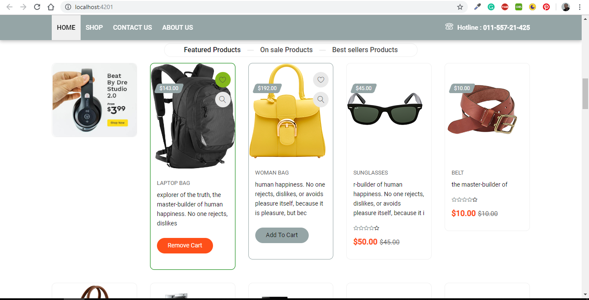 

<h5>shop</h5>
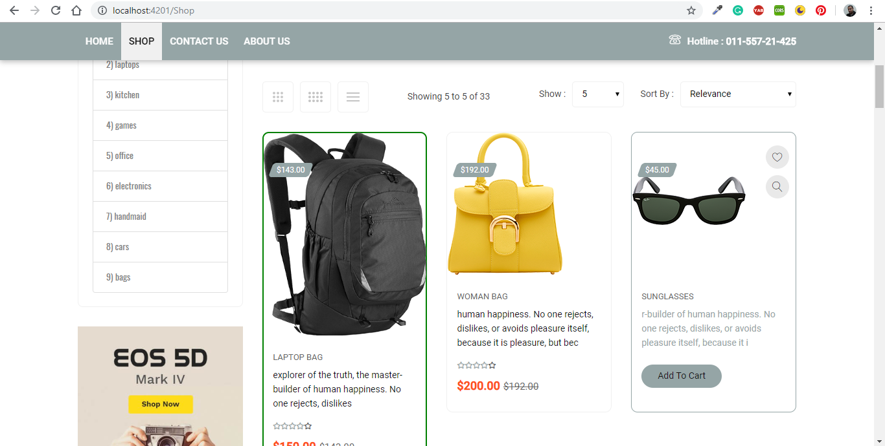 

<h5>wish list</h5>
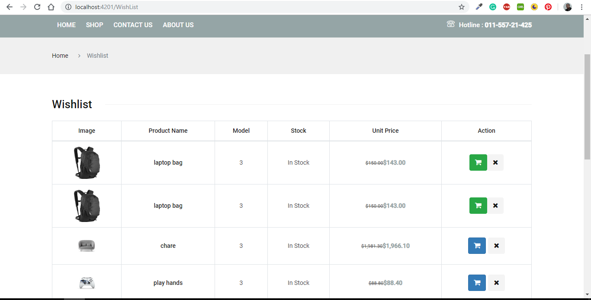 

<h5>register</h5>
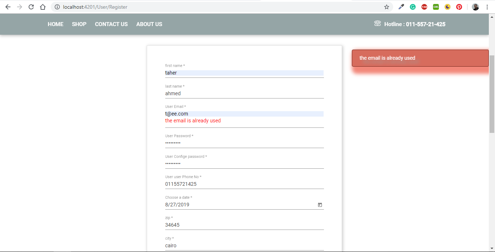 

<h5>login</h5>
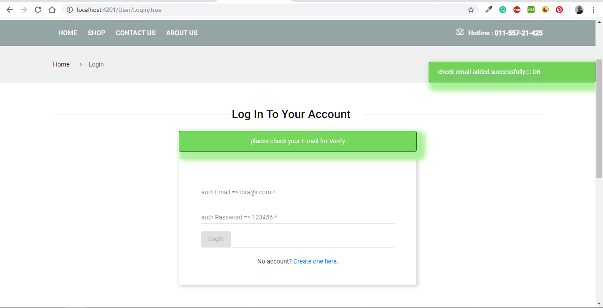 

<h5>send mail</h5>
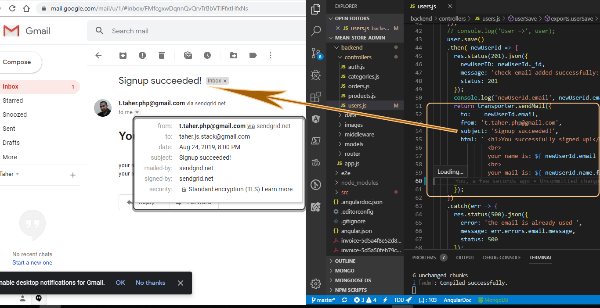 

<h5> email validation from backend msg</h5>
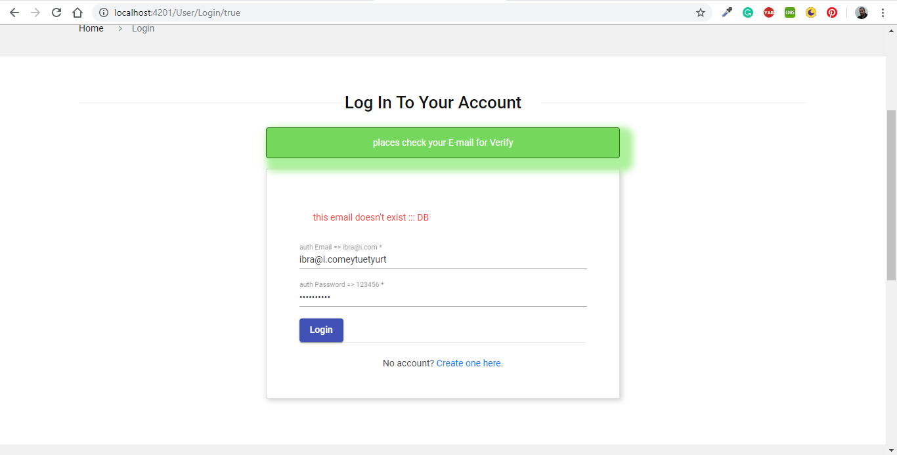 

<h5> password validation backend msg</h5>
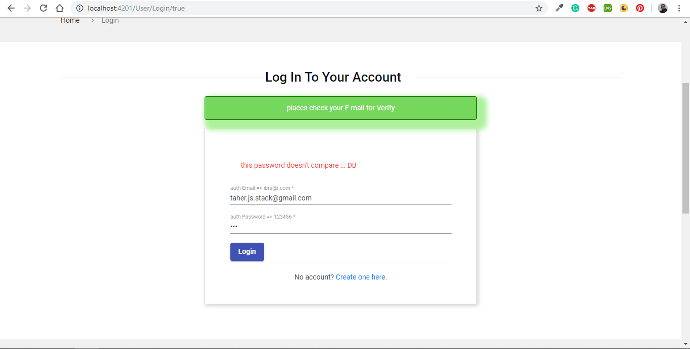 

<h5>profile</h5>
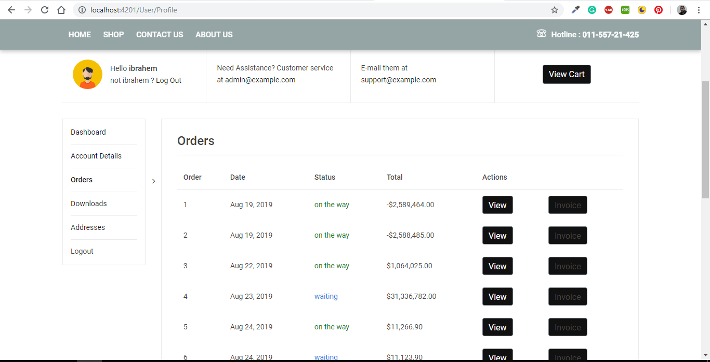 

<h5>cart</h5>
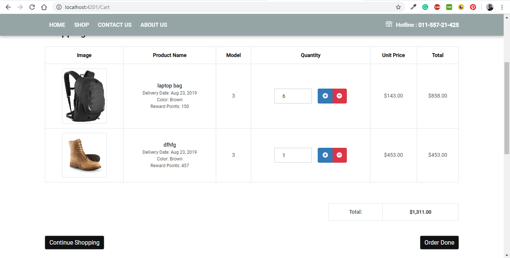 

<h5>send send done</h5>
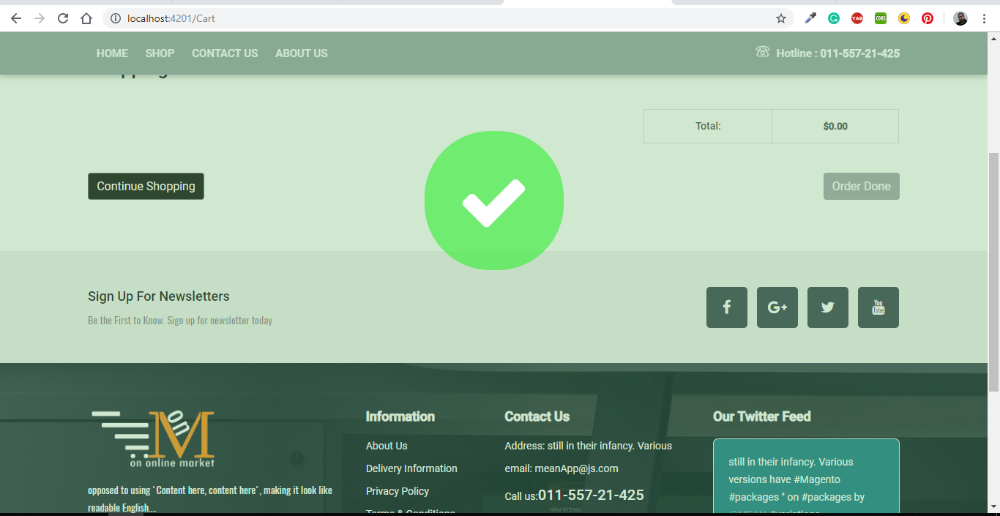 
# frontend-angular-eCommerce
